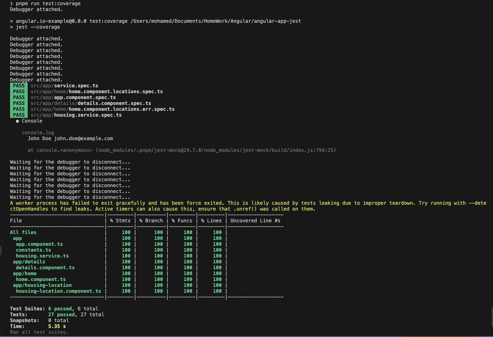

````markdown
# Project Angular with Jest

## Testing Configuration

### Install Jest Packages

```bash
npm install -D jest jest-preset-angular @types/jest
```
````

### Uninstall Karma and Jasmine Packages

```bash
npm remove @types/jasmine jasmine-core karma karma-chrome-launcher karma-coverage karma-jasmine karma-jasmine-html-reporter
```

### Create 2 Jest Setup Files

1. **/jest.config.js**

   ```javascript
   module.exports = {
     preset: "jest-preset-angular",
     setupFilesAfterEnv: ["<rootDir>/setup-jest.ts"],
   };
   ```

2. **/setup-jest.ts**

   ```typescript
   import "jest-preset-angular/setup-jest";
   ```

### Update Files

1. **/tsconfig.spec.json**

   ```json
   {
     "extends": "./tsconfig.json",
     "compilerOptions": {
       "outDir": "./out-tsc/spec",
       "types": ["jest"]
     },
     "include": ["src/**/*.spec.ts", "src/**/*.d.ts"]
   }
   ```



## Todo

Refactor:

- home.component spec files ( for Group A)
- Add blog, reserved and others .... (for Group B)

## Getting Started

...

## Usage

...

## License

This project is licensed under the MIT License - see the [LICENSE](LICENSE) file for details.

```

Feel free to customize the sections based on your project's details and add more content as needed.
```
